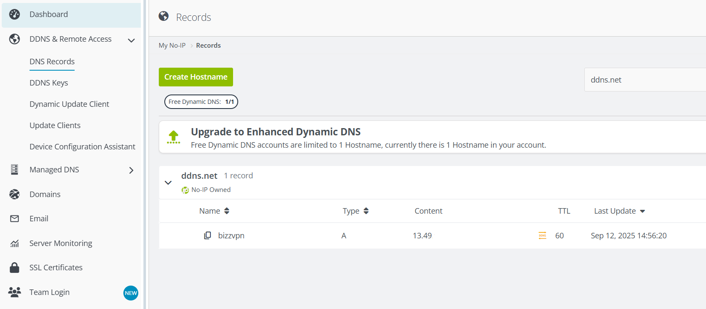

# 🌐 VPN-HOME-SERVER . Wireguard + No-IP sur EC2 Ubuntu

Configuration d’un serveur VPN personnel sur un VPS Ubuntu distant : SSH par clé, pare-feu, DNS dynamique (No-IP), sécurisation et documentation complète.

Ce projet documente la mise en place complète d'un **serveur VPN personnel** hébergé sur un VPS Ubuntu, avec gestion DNS dynamique, connexion SSH sécurisée et outils système essentiels.

## 📚 Sommaire

- [🎯 Objectifs du projet](#-objectifs-du-projet)
- [🧰 Stack Utilisée](#-stack-utilisée)
- [✅ Étapes réalisées](#-étapes-réalisées)
- [📸 Captures d'écran](#captures-décran)
- [✍️ Auteur](#️-auteur)

---

## 🎯 Objectifs du projet

- Créer un serveur accessible à distance via un nom de domaine dynamique.
- Sécuriser l'accès SSH (clé privé `.pem`, désactivation de l'accès root)
- Ajouter un service VPN (prochaine étape : Wireguard).
- Documenter toutes les étapes pour les reproduire.

  
---

## 🧰 Stack Utilisée

| Outil / Service       | Rôle                                          |
|-----------------------|-----------------------------------------------|
| Ubuntu 24.04 (EC2)    | Serveur VPS                                   |
| SSH                   | Connexion sécurisée par clé privée `.pem`     |
| UFW                   | Pare-feu (ouverture port SSH uniquement)      |
| No-IP (DDNS)          | DNS dynamique (ex. `bizzvpn.ddns.net`)        |
| WireGuard             | VPN sécurisé (UDP 65193)                      |
| PowerShell + WSL      | Connexions depuis Windows                     |

---

## ✅ Étapes réalisées

### Mise en place du serveur

1. Création d'une instance EC2 Ubuntu sur AWS
2. Géneration & sécurisation de la clé `.pem`
3.  Paramétrage des droits Windows sur la clé (chmod 600 équivalent)
3.  Création du domaine dynamique sur [No-IP](https://www.noip.com/)
4.  Installation du **No-IP DUC** (`nopi2`) sur le serveur
5.  Mise à jour automatique de l'IP publique via No-IP
6.  Test de connexion depuis Windows (`ssh -i .\azerty.pem ubuntu@bizz.ddns.net`)
7.  Ouverture des ports nécessaires dans le groupe de sécurité AWS :
    TCP 22 (SSH)
    USP 65193 (Wireguard)

### Installation et configuration de Wireguard

`sudo apt update && sudo apt install wireguard`

- Installtion de Wireguard sur Ubuntu :
- sudo apt install wireguard

  Génération des paires de clés serveur et client
  
    Configuration du fichier `wg0.conf` sur le serveur
      IP LOCAL
      Port: 65193
      Routage et NAT avec `iptables`

    Configuration du fichier `wg0.conf` sur le client (Windows)
      Endpoint : [Entrer l'adresse DNS]
      Adresse client :
      DNS personalisé : 1.1.1.1

  ### Test de Connectivité

    Connection VPN établie depuis Windows
    IP publique remplacé par celle du serveur
    Fonctionne sur:
        Partage 4G
        Réseau étudiant (Résidence Universitaire)
  

---

## Captures d'écran

- #### Connection SSH réussie

Connexion réussie au server EC2 Ubuntu via SSH avec le nom de domaine dynamique `bizzvpn.ddns.net` : 

- #### Interface No-IP avec domaine `bizzvpn.ddns.net` actif

Voici un aperçu de la configuration du domaine dynamique `bizzvpn.ddns.net` via l’interface No-IP

- #### Configuration Wireguard côté Windows

  

  ---

## ✍️ Auteur

[Randy BIZET](https://github.com/Bizz97x)  
Etudiant en Mastère Architecture des Systèmes d’Information à ETNA  
Passionné par les systèmes, réseaux et virtualisation.

  

