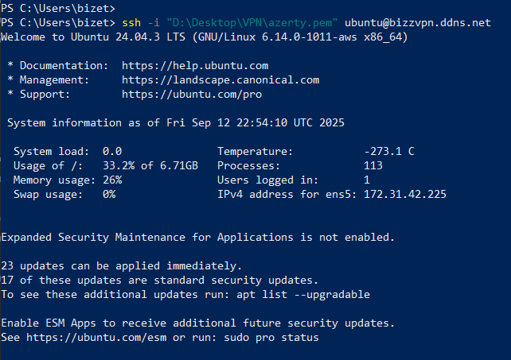

# 🌐 VPN-HOME-SERVER
Configuration d’un serveur VPN personnel sur un VPS Ubuntu distant : SSH par clé, pare-feu, DNS dynamique (No-IP), sécurisation et documentation complète.

Ce projet documente la mise en place complète d'un **serveur VPN personnel** hébergé sur un VPS Ubutun, avec gestion DNS dynamique, connexion SSH sécurisée et outils système essentils.

## Objectifs du projet

- Créer un serveur accessible à distance via un nom de domaine dynamique.
- Sécuriser l'accès SSh (clé privé `.pem`, désactivation de l'utilisateur root si souhaité)??
- Ajouter un service VPN (prochaine étape : Wireguard).
- Documenter toutes les étapes pour les reproduire.
  
---

## Stack Utilisée

| Outil / Service       | Rôle                                          |
|-----------------------|-----------------------------------------------|
| Ubuntu 24.04 (EC2)    | Serveur VPS                                   |
| SSH                   | Connexion sécurisée par clé privée `.pem`     |
| UFW                   | Pare-feu (ouverture port SSH uniquement)      |
| No-IP (DDNS)          | DNS dynamique (ex. `bizzvpn.ddns.net`)        |
| PowerShell + WSL      | Connexions depuis Windows                     |

---

## Etapes réalisées

1. Géneration & sécurisation de la clé `.pem`
2.  Paramétrage des droits Windows sur la clé (chmod 600 équivalent)
3.  Création du domaine dynamique sur [No-IP](https://www.noip.com/)
4.  Installation du **No-IP DUC** (`nopi2`) sur le serveur
5.  Mise à jour automatique de l'IP publique via No-IP
6.  Test de connexion depuis Windows (`ssh -i .\azerty.pem ubuntu@bizz.ddns.net`)
7.  (à venir) Installation et configuration d'un serveur **Wireguard**

---

## Screenshot

- #### Connection SSH réussie

Voici la connexion réussie au server EC2 Ubuntu via SSH avec le nom de domaine dynamique `bizzvpn.ddns.net` : 

- Interface No-IP avec domaine `bizzvpn.ddns.net` actif

  ---

  

